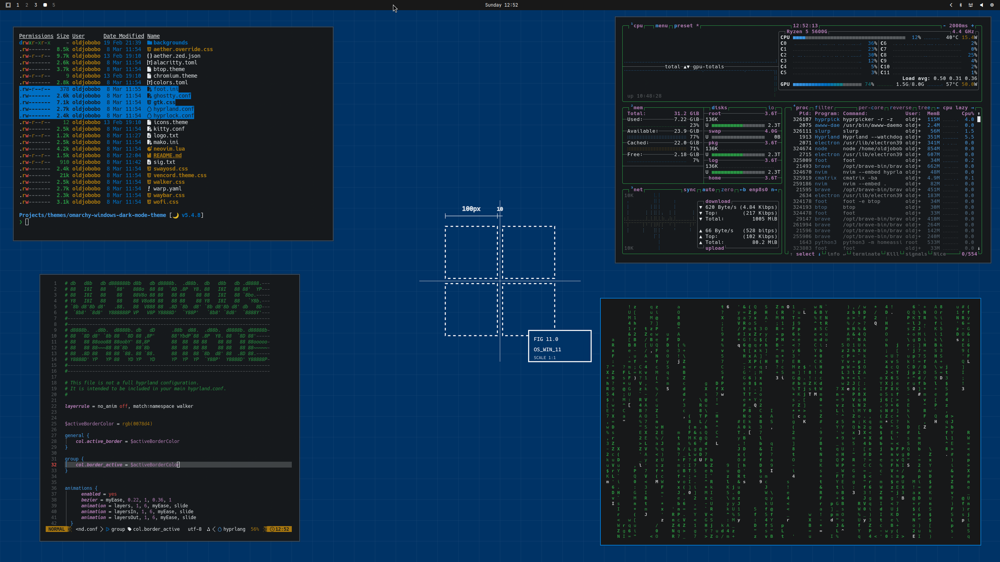

# Omarchy Windows Dark Mode Theme

A clean Windows-inspired dark theme for Omarchy with a neutral charcoal base, bright white text, and a classic blue accent (`#0078d4`).

## Preview



## Install

Use the Omarchy theme installer:

```bash
omarchy-theme-install https://github.com/oldjobobo/omarchy-windows-dark-mode-theme
```

## Widgets

**Optional overlays**
- None included in this theme.

## Wallpapers

<table>
  <tr>
    <td></td>
    <td></td>
    <td></td>
  </tr>
  <tr>
    <td></td>
    <td></td>
    <td></td>
  </tr>
</table>

## Requirements

- A Hyprland-based Omarchy setup
- Waybar
- At least one supported terminal (Alacritty, Kitty, Ghostty, or Foot)

## Notes

- Accent color is set to Windows blue (`#0078d4`) across terminal/UI palette files.
- Includes `foot.ini` alongside `alacritty.toml`, `kitty.conf`, and `ghostty.conf`.
- This theme directory is self-contained and intended to be applied through Omarchy theme switching.

## Attribution

- Inspired by the Windows dark mode visual style and accent palette.
- Wallpapers are from included background assets in this repository/theme folder.
